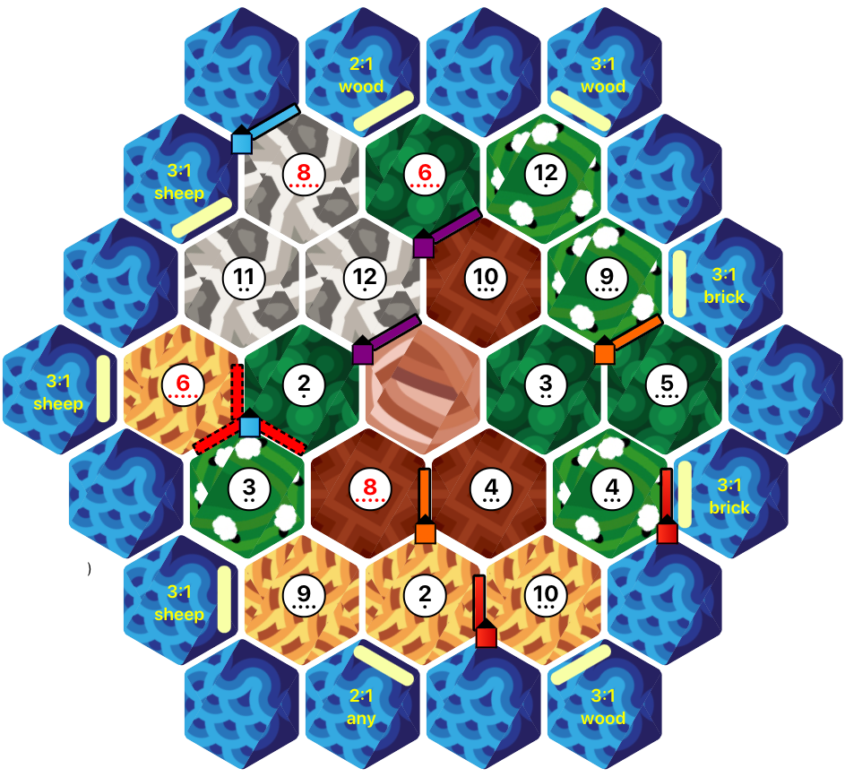

## Catan Board Game

This is a project I started during the COVID pandemic so that my friends and I could play Catan and practice social distancing.

## Stack
- [React JS](https://reactjs.org/)
- [BoardGame IO](https://boardgame.io)

I've stopped development on this for the meantime. It's quite a big project, and I've been focusing on other projects/interests lately.
This is my first React project, and I learned a ton. I really enjoyed the Board Game IO framework, great documentation! 
I'm not the biggest fan of how I implemented this project, don't look at this as a "how-to" in ways to use board-game io. This was just 
a fun little tinkering project.

